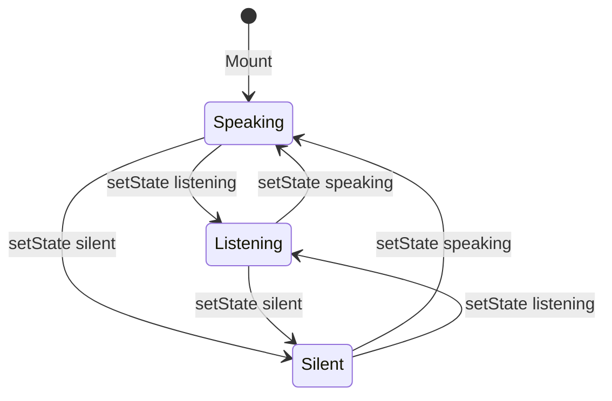

# Avatar Motions – Catalog and Design Notes

Catalog of every Avatar motion, visual behavior, and implementation details. Aligned with Apple HIG principles: velocity continuity, spring-based transitions, and smooth state handoffs.

---

## 1. Motion Catalog

| Motion | Property | Range | Visual | Implementation |
|--------|----------|-------|--------|----------------|
| **Breathing (size)** | size | min→max, max→min | Circle inhales and exhales in a loop | `withSpring` (dampingRatio 1), `APPLE_SPRING_BREATHING` |
| **Listening** | size | 142→150 | Smaller circle, subtle pulse while user speaks | `loopListeningMotion` – same as breathing, smaller range |
| **Speaking** | size | 150→158 | Full circle, breath during avatar speech | `loopSpeakingMotion` |
| **Silent** | size | 150→154 | Subtle idle pulse, minimal movement | `loopSilentMotion` |
| **Happy** | scale | 1→1.05→1 | Quick pulse up, spring back to 1 | `withTiming` up + `withSpring` return |
| **Sad** | scale | 1→0.97→1 | Shrink, spring back | Same pattern |
| **Calm** | scale | 1→1.025→1 | Gentle swell, spring back | `withTiming` up + `withSpring` return |
| **Neutral** | scale | current→1 | Fade to baseline | `withTiming(1)` |
| **Viewer transition** | size, translateY, scale | Circle shrinks to 48, moves up | Circle moves to content area; content fades in | `withSpring` for all |
| **Assistant transition** | size, translateY, scale | Spring to 150, then breathing | Full circle returns, breathing starts | Spring + spring-based breathing loop |
| **Line** | opacity, strokeDashoffset | 0→1 or 1→0 | Double-tap reveals diagonal line | `withTiming`, `Easing.out` |

---

## 2. State Diagram

**State transitions**: Each `setState` runs a bridge spring from current size to the new range’s min, then starts the breathing loop. This avoids hard cuts and keeps motion continuous.

---

## 3. Emotion Overlay

Emotions animate **scale** on top of the **size** breathing. Both run in parallel:

- **Size**: Breathing loop (listening/speaking/silent)
- **Scale**: Emotion pulse (happy, sad, calm, neutral)

Scale defaults to 1. Emotions temporarily change scale; they return to 1 via spring for smooth reversals.

---

## 4. Design References

- **Apple HIG – Animation**: Velocity continuity, springs preferred over easing for natural motion (WWDC 2023 “Animate with springs”).
- **Siri-style states**: Listening = smaller/quieter; Speaking = full presence; Silent = minimal movement.
- **Spring over timing**: Springs keep position and velocity continuous at boundaries; easing curves can introduce hitches.

---

## 5. Implementation Notes

### Why springs for breathing

- `withTiming` + Easing.inOut can cause velocity discontinuities at cycle boundaries.
- `withSpring` with `dampingRatio: 1` (critically damped) gives smooth inhale/exhale without overshoot.

### State switch handoff

- **Before**: `cancelAnimation(size)` → start new loop (micro-hitch when curve starts).
- **After**: `withSpring(newRange.min)` → on complete → start breathing loop. Bridge spring smoothes the transition.

### Constants

- `APPLE_SPRING_BREATHING`: `{ duration: BREATH_DURATION (800ms), dampingRatio: 1 }`
- `APPLE_SPRING_SNAPPY`: `{ duration: 250, dampingRatio: 1 }`
- `APPLE_SPRING_SUBTLE`: `{ duration: 280, dampingRatio: 0.9 }` – used for emotion returns
