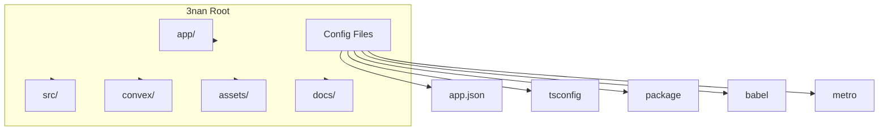
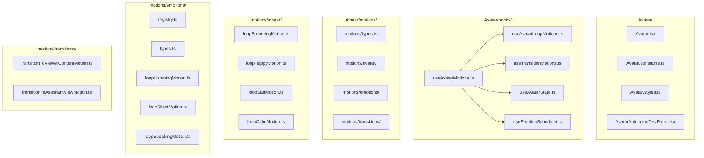
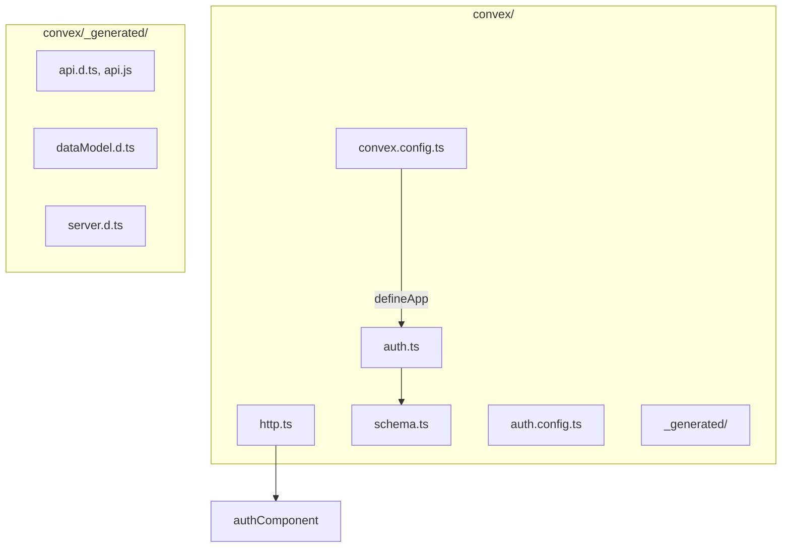
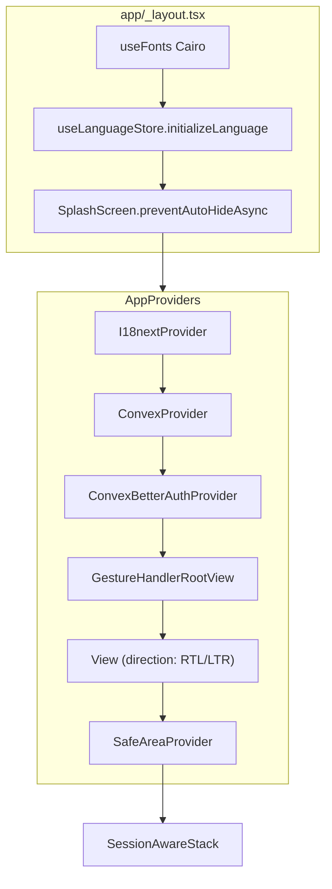
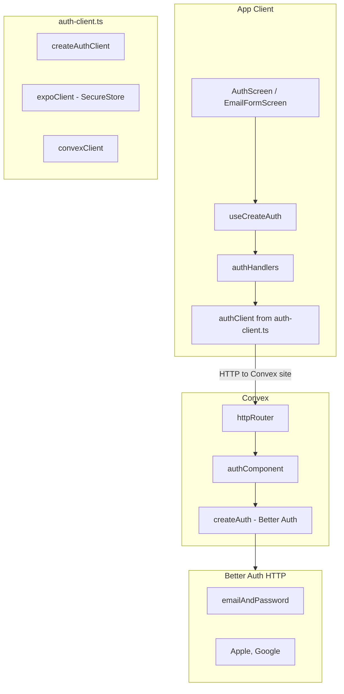
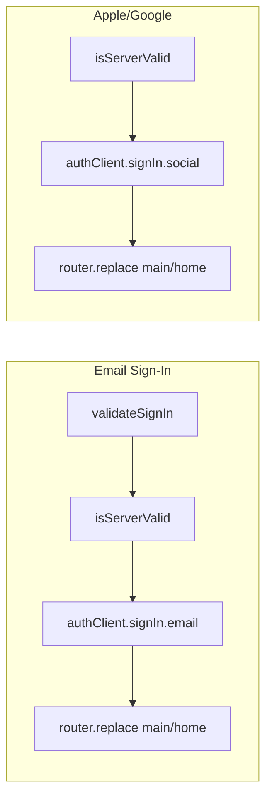
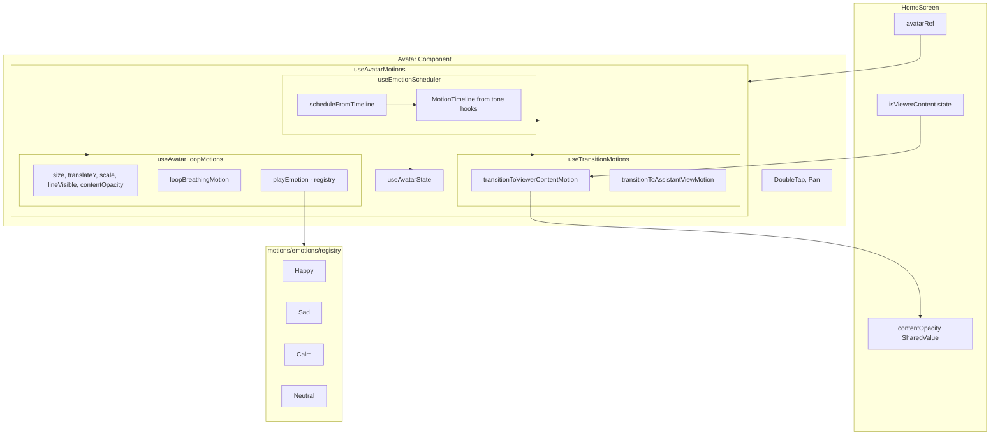
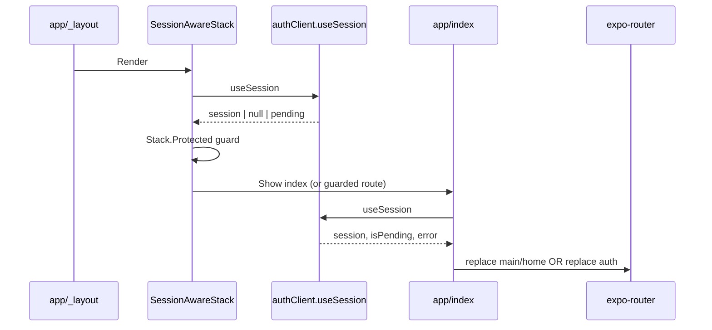

# 3nan Architecture - Flowchart Design Document

Deep architecture analysis of the 3nan codebase with flowcharts for folders, files, and data flows.

---

## 1. Executive Summary

**3nan** is a React Native (Expo) app with:

- **Languages**: Arabic and English (RTL/LTR)
- **Backend**: Convex + Better Auth
- **Auth**: Email/password, Apple, Google
- **Core UI**: Avatar with breathing, emotion, and viewer-content transitions

**Tech Stack**: Expo 54, React 19, React Native Reanimated, Gesture Handler, Zustand, i18next, Convex, Better Auth.

---

## 2. Folder and File Structure Flowchart

### 2.1 Project Root Structure



### 2.2 App Folder (Expo Router Routes)

```mermaid
flowchart TB
    subgraph AppFolder [app/]
        layout[_layout.tsx]
        index[index.tsx]
        authGroup["(auth)/"]
        mainGroup["(main)/"]
    end

    layout --> |"Fonts, language, splash"| Providers
    index --> |"Session check"| Redirect

    subgraph AuthGroup [app/(auth)/]
        authLayout[auth/_layout.tsx]
        authIndex[auth/index.tsx]
        authEmail[auth/email.tsx]
    end

    subgraph MainGroup [app/(main)/]
        mainLayout[main/_layout.tsx]
        mainHome[main/home.tsx]
    end

    authIndex --> AuthScreen
    authEmail --> EmailFormScreen
    mainHome --> HomeScreen

    AppFolder --> authGroup
    AppFolder --> mainGroup
```

### 2.3 Source Folder (src/) - Complete Tree

```mermaid
flowchart TB
    subgraph Src [src/]
        components[components/]
        hooks[hooks/]
        lib[lib/]
        locales[locales/]
        navigation[navigation/]
        screens[screens/]
        shared[shared/]
        store[store/]
        theme[theme/]
        types[types/]
        assetsSrc[assets/]
    end

    subgraph Components [components/]
        providers[providers/]
        ui[ui/]
    end

    subgraph Providers [providers/]
        AppProviders[AppProviders.tsx]
        providersIndex[index.ts]
    end

    subgraph UI [ui/]
        Button[Button/]
        uiIndex[index.ts]
    end

    subgraph ButtonDir [Button/]
        ButtonTsx[Button.tsx]
        ButtonStyles[Button.styles.ts]
        buttonIndex[index.ts]
    end

    subgraph Hooks [hooks/]
        debugger[debugger/]
        interaction[interaction/]
        language[language/]
        motion[motion/]
        performance[performance/]
        screen[screen/]
        tone[tone/]
        hooksIndex[index.ts]
    end

    subgraph Screens [screens/]
        auth[auth/]
        main[main/]
    end

    subgraph AuthScreen [auth/]
        AuthScreenTsx[AuthScreen.tsx]
        EmailFormScreen[EmailFormScreen.tsx]
        authStyles[AuthScreen.styles.ts, EmailFormScreen.styles.ts]
        authIndex[auth/index.ts]
        handlers[handlers/authHandlers.ts]
        authHooks[hooks/useCreateAuth.ts]
        authUtils[utils/authUtils.ts]
    end

    subgraph MainScreen [main/]
        HomeScreen[HomeScreen.tsx]
        mainIndex[main/index.ts]
        mainComponents[components/]
    end

    subgraph MainComponents [main/components/]
        Avatar[Avatar/]
        ViewerContent[ViewerContentLayout/]
    end

    subgraph AvatarDir [Avatar/]
        AvatarTsx[Avatar.tsx]
        AvatarConstants[Avatar.constants.ts]
        AvatarStyles[Avatar.styles.ts]
        AvatarTestPanel[AvatarAnimationTestPanel.tsx]
        AvatarIndex[index.ts]
        avatarHooks[hooks/]
        avatarMotions[motions/]
    end

    Src --> components
    Src --> hooks
    Src --> lib
    Src --> screens
    Src --> shared
    Src --> store
    Src --> theme
    Src --> navigation
    Src --> locales
    Src --> types
```



### 2.4 Avatar Component - Deep Structure



### 2.5 Convex Backend Structure



---

## 3. Provider Tree Flowchart



---

## 4. Routing and Session Flow

```mermaid
flowchart TB
    subgraph SessionAware [SessionAwareStack]
        Index[Stack.Screen index]
        ProtectedMain["Stack.Protected guard=session"]
        ProtectedAuth["Stack.Protected guard=!session"]
    end

    subgraph IndexLogic [app/index.tsx]
        CheckNav[Navigation ready?]
        CheckPending[Session pending?]
        CheckError[Error?]
        HasSession{Has session?}
        ToMain[router.replace main/home]
        ToAuth[router.replace auth]
    end

    CheckNav --> CheckPending
    CheckPending --> CheckError
    CheckError --> HasSession
    HasSession -->|Yes| ToMain
    HasSession -->|No| ToAuth

    subgraph AuthRoutes [app/(auth)/]
        AuthIndex[auth/index - AuthScreen]
        AuthEmail[auth/email - EmailFormScreen]
    end

    subgraph MainRoutes [app/(main)/]
        MainHome[main/home - HomeScreen]
    end

    ProtectedMain --> MainHome
    ProtectedAuth --> AuthIndex
    ProtectedAuth --> AuthEmail
```

---

## 5. Authentication Flow



### 5.1 Auth Handler Flow (Detail)



---

## 6. Avatar Motion Pipeline



### 6.1 Avatar State and Emotion Flow

```mermaid
flowchart LR
    subgraph Inputs [Inputs]
        Timeline["MotionTimeline (useToneParse)"]
        ManualPlay[playHappy/playSad/playCalm]
        StateSet[setState]
    end

    subgraph useAvatarState [useAvatarState]
        CurrentState[listening | speaking | silent]
    end

    subgraph useEmotionScheduler [useEmotionScheduler]
        Schedule[scheduleFromTimeline]
    end

    subgraph Motions [Motions]
        LoopMotions[loopListening, loopSpeaking, loopSilent]
        EmotionMotions[loopHappy, loopSad, loopCalm]
    end

    Timeline --> Schedule
    Schedule --> StateSet
    Schedule --> playEmotion
    ManualPlay --> EmotionMotions
    StateSet --> CurrentState
    CurrentState --> LoopMotions
```

---

## 7. Data Flow - Session to Route



---

## 8. File Inventory by Directory

| Directory | Files | Purpose |
|-----------|-------|---------|
| `app/` | `_layout.tsx`, `index.tsx` | Root layout, session redirect |
| `app/(auth)/` | `_layout.tsx`, `index.tsx`, `email.tsx` | Auth routes |
| `app/(main)/` | `_layout.tsx`, `home.tsx` | Main routes |
| `src/components/providers/` | `AppProviders.tsx`, `index.ts` | Provider tree |
| `src/components/ui/Button/` | `Button.tsx`, `Button.styles.ts`, `index.ts` | Button component |
| `src/hooks/language/` | `useAppTranslation`, `useIsRTL`, `useLayoutDirection` | i18n, RTL |
| `src/hooks/screen/` | `useScreenSize`, `useResponsive` | Breakpoints |
| `src/hooks/motion/` | `useMotionScreen` | Insets, contentCenterY |
| `src/hooks/performance/` | `useMotionPerformance` | Reduce motion |
| `src/hooks/debugger/` | `useDebugFPS`, `useDebugMemory`, `useDebugPerformance` | Dev overlay |
| `src/hooks/interaction/` | `useHapticFeedback` | Tap feedback |
| `src/hooks/tone/` | `useToneParse`, `useToneToTimeline`, `types` | Tone → MotionTimeline |
| `src/lib/` | `auth-client.ts` | Better Auth client |
| `src/locales/` | `ar.json`, `en.json`, `index.ts` | i18n resources |
| `src/navigation/` | `SessionAwareStack.tsx`, `index.ts` | Session-aware stack |
| `src/screens/auth/` | Screens, handlers, hooks, utils | Auth flow |
| `src/screens/main/` | `HomeScreen`, Avatar, ViewerContentLayout | Main app |
| `src/shared/components/` | `ErrorView`, `LoadingView` | Shared UI |
| `src/store/` | `useLanguageStore` | Language, RTL |
| `src/theme/` | `index.ts` | Colors, spacing, typography |
| `convex/` | `auth.ts`, `http.ts`, `schema.ts` | Backend |

---

## 9. Import Path Aliases

| Alias | Resolves to |
|-------|-------------|
| `@/*` | `src/*` |
| `@/screens/*` | `src/screens/*` |
| `@/shared/*` | `src/shared/*` |
| `@/store/*` | `src/store/*` |
| `@/theme/*` | `src/theme/*` |
| `@/navigation/*` | `src/navigation/*` |

---

## 10. Key Dependencies

| Package | Role |
|---------|------|
| `expo` | App runtime, Expo Router |
| `convex` | Backend, reactive queries |
| `@convex-dev/better-auth` | Auth adapter for Convex |
| `better-auth` | Auth provider (email, social) |
| `react-native-reanimated` | Avatar animations |
| `react-native-gesture-handler` | Avatar gestures |
| `zustand` | useLanguageStore |
| `i18next`, `react-i18next` | Translations |
| `@expo-google-fonts/cairo` | Arabic-supporting font |
